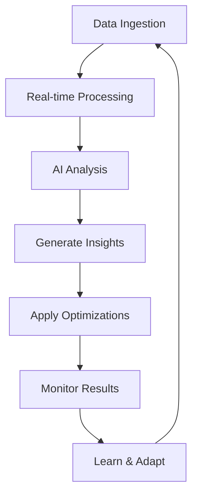

# 🤖 AI Agents Roadmap & Workflow
## Campaign Optimization Intelligence System

### 📋 Table of Contents
- [Overview](#overview)
- [System Architecture](#system-architecture)
- [AI Agent Capabilities](#ai-agent-capabilities)
- [Development Roadmap](#development-roadmap)
- [Implementation Workflow](#implementation-workflow)
- [Data Pipeline](#data-pipeline)
- [AI Models & Algorithms](#ai-models--algorithms)
- [Integration Strategy](#integration-strategy)
- [Optimization Framework](#optimization-framework)
- [Monitoring & Analytics](#monitoring--analytics)
- [Future Enhancements](#future-enhancements)

---

## 🎯 Overview

### Mission Statement
Develop intelligent AI agents that autonomously optimize Google Ads and Meta Ads campaigns through real-time analysis, predictive insights, and automated decision-making.

### Key Objectives
- **Automated Campaign Optimization**: Reduce manual campaign management by 80%
- **Budget Efficiency**: Improve ROAS (Return on Ad Spend) by 25-40%
- **Predictive Analytics**: Prevent budget overruns and performance drops
- **Smart Recommendations**: Provide actionable insights based on campaign data
- **Cross-Platform Intelligence**: Unified optimization across Google and Meta platforms

---

## 🏗️ System Architecture

### High-Level Architecture
```
┌─────────────────────────────────────────────────────────────┐
│                    Frontend Dashboard                        │
│  ┌─────────────────┐ ┌─────────────────┐ ┌───────────────┐ │
│  │   Google Ads    │ │    Meta Ads     │ │  AI Insights  │ │
│  │   Management    │ │   Management    │ │   Dashboard   │ │
│  └─────────────────┘ └─────────────────┘ └───────────────┘ │
└─────────────────────────────────────────────────────────────┘
                              │
┌─────────────────────────────────────────────────────────────┐
│                     API Gateway                             │
│  ┌─────────────────┐ ┌─────────────────┐ ┌───────────────┐ │
│  │   Auth Layer    │ │  Rate Limiting  │ │ Load Balancer │ │
│  └─────────────────┘ └─────────────────┘ └───────────────┘ │
└─────────────────────────────────────────────────────────────┘
                              │
┌─────────────────────────────────────────────────────────────┐
│                   AI Agent Engine                           │
│  ┌─────────────────┐ ┌─────────────────┐ ┌───────────────┐ │
│  │  Google Agent   │ │   Meta Agent    │ │ Cross-Platform│ │
│  │   Optimizer     │ │   Optimizer     │ │   Analyzer    │ │
│  └─────────────────┘ └─────────────────┘ └───────────────┘ │
└─────────────────────────────────────────────────────────────┘
                              │
┌─────────────────────────────────────────────────────────────┐
│                   Data Processing Layer                     │
│  ┌─────────────────┐ ┌─────────────────┐ ┌───────────────┐ │
│  │  Data Ingestion │ │   ML Pipeline   │ │  Data Storage │ │
│  │    Service      │ │    Service      │ │   Service     │ │
│  └─────────────────┘ └─────────────────┘ └───────────────┘ │
└─────────────────────────────────────────────────────────────┘
                              │
┌─────────────────────────────────────────────────────────────┐
│                  External APIs                              │
│  ┌─────────────────┐ ┌─────────────────┐ ┌───────────────┐ │
│  │  Google Ads API │ │  Meta Graph API │ │  Analytics    │ │
│  │                 │ │                 │ │     APIs      │ │
│  └─────────────────┘ └─────────────────┘ └───────────────┘ │
└─────────────────────────────────────────────────────────────┘
```

### Technology Stack
- **Backend**: Python (FastAPI/Django)
- **AI/ML**: TensorFlow, PyTorch, Scikit-learn
- **Data Processing**: Apache Airflow, Pandas, NumPy
- **Database**: PostgreSQL, Redis, MongoDB
- **Message Queue**: Redis/RabbitMQ
- **Monitoring**: Grafana, Prometheus
- **Cloud**: AWS/GCP with auto-scaling

---

## 🧠 AI Agent Capabilities

### 1. Google Ads Agent
#### Core Features
- **Keyword Optimization**
  - Performance analysis and bidding strategies
  - Negative keyword identification
  - Long-tail keyword discovery
  - Search term mining

- **Budget Management**
  - Dynamic budget allocation
  - Spending pace optimization
  - ROI-based budget distribution
  - Seasonal adjustment algorithms

- **Campaign Structure Optimization**
  - Ad group reorganization
  - Campaign splitting strategies
  - Geographic performance analysis
  - Device-specific optimizations

#### Advanced Capabilities
- **Predictive Analytics**
  - Conversion rate forecasting
  - Budget depletion predictions
  - Performance trend analysis
  - Market volatility detection

### 2. Meta Ads Agent
#### Core Features
- **Audience Optimization**
  - Lookalike audience creation
  - Interest targeting refinement
  - Custom audience management
  - Audience overlap analysis

- **Creative Performance Analysis**
  - A/B testing automation
  - Creative fatigue detection
  - Ad format optimization
  - Visual content analysis

- **Placement Optimization**
  - Cross-platform performance analysis
  - Automatic placement adjustments
  - Feed vs Stories optimization
  - Video vs Image performance

#### Advanced Capabilities
- **Behavioral Analysis**
  - User journey mapping
  - Conversion attribution modeling
  - Lifetime value predictions
  - Churn probability assessment

### 3. Cross-Platform Intelligence
- **Unified Budget Allocation**
- **Cross-platform audience insights**
- **Competitive analysis integration**
- **Holistic performance reporting**

---

## 🗺️ Development Roadmap

### Phase 1: Foundation (Weeks 1-4)
#### Backend Infrastructure
- [ ] Set up Python backend with FastAPI
- [ ] Implement Google Ads API integration
- [ ] Implement Meta Graph API integration
- [ ] Create database schema and models
- [ ] Set up authentication and authorization

#### Data Pipeline
- [ ] Build data ingestion services
- [ ] Create ETL processes for campaign data
- [ ] Implement data validation and cleaning
- [ ] Set up real-time data streaming

### Phase 2: Core AI Agents (Weeks 5-8)
#### Google Ads Agent
- [ ] Keyword performance analyzer
- [ ] Budget optimization algorithms
- [ ] Basic recommendation engine
- [ ] Campaign health monitoring

#### Meta Ads Agent
- [ ] Audience performance analyzer
- [ ] Creative optimization engine
- [ ] Placement recommendation system
- [ ] Budget allocation optimizer

### Phase 3: Advanced Intelligence (Weeks 9-12)
#### Predictive Models
- [ ] Performance forecasting models
- [ ] Budget depletion prediction
- [ ] Conversion rate optimization
- [ ] Seasonal trend analysis

#### Automation Features
- [ ] Automated bid adjustments
- [ ] Auto-pausing underperforming ads
- [ ] Dynamic budget reallocation
- [ ] Smart campaign scaling

### Phase 4: Cross-Platform Optimization (Weeks 13-16)
#### Unified Intelligence
- [ ] Cross-platform budget optimization
- [ ] Unified audience insights
- [ ] Competitive analysis integration
- [ ] Holistic performance dashboard

#### Advanced Analytics
- [ ] Customer journey analysis
- [ ] Attribution modeling
- [ ] Lifetime value optimization
- [ ] Market trend analysis

### Phase 5: Production & Optimization (Weeks 17-20)
#### Performance Optimization
- [ ] Model fine-tuning and validation
- [ ] Performance monitoring setup
- [ ] Error handling and recovery
- [ ] Scalability improvements

#### User Experience
- [ ] Frontend optimization integration
- [ ] Real-time notifications
- [ ] Custom reporting features
- [ ] Mobile responsiveness

---

## ⚙️ Implementation Workflow

### Daily Operations


### Weekly Optimization Cycle
1. **Monday**: Performance review and strategy adjustment
2. **Tuesday-Thursday**: Continuous optimization and monitoring
3. **Friday**: Weekly reporting and model retraining
4. **Weekend**: Data processing and system maintenance

### Monthly Development Cycle
1. **Week 1**: Feature development and testing
2. **Week 2**: Integration and quality assurance
3. **Week 3**: Deployment and monitoring
4. **Week 4**: Performance analysis and planning

---

## 🔄 Data Pipeline

### Data Sources
```python
# Data ingestion configuration
DATA_SOURCES = {
    'google_ads': {
        'campaigns': 'hourly',
        'keywords': 'daily',
        'ad_groups': 'daily',
        'ads': 'daily'
    },
    'meta_ads': {
        'campaigns': 'hourly',
        'ad_sets': 'daily',
        'ads': 'daily',
        'audiences': 'daily'
    },
    'external': {
        'google_analytics': 'daily',
        'competitors': 'weekly',
        'market_trends': 'daily'
    }
}
```

### Processing Pipeline
1. **Ingestion**: Real-time API polling and webhook handling
2. **Validation**: Data quality checks and anomaly detection
3. **Transformation**: Normalization and feature engineering
4. **Storage**: Time-series and relational data storage
5. **Analysis**: ML model processing and insight generation

### Data Flow Architecture
```
API Sources → Queue → Validation → Transform → ML Models → Insights → Actions
```

---

## 🤖 AI Models & Algorithms

### Machine Learning Models

#### 1. Time Series Forecasting
```python
# Performance prediction model
class PerformanceForecast:
    models = [
        'ARIMA',           # Seasonal trends
        'LSTM',            # Long-term patterns
        'Prophet',         # Holiday effects
        'XGBoost'          # Feature importance
    ]
```

#### 2. Classification Models
```python
# Campaign health classification
class CampaignHealthClassifier:
    categories = [
        'high_performance',
        'needs_optimization',
        'underperforming',
        'critical_attention'
    ]
```

#### 3. Optimization Algorithms
```python
# Budget allocation optimization
class BudgetOptimizer:
    algorithms = [
        'genetic_algorithm',    # Global optimization
        'particle_swarm',      # Multi-objective
        'gradient_descent',    # Local optimization
        'reinforcement_learning' # Adaptive learning
    ]
```

### Model Training Strategy
- **Online Learning**: Continuous model updates
- **A/B Testing**: Model performance comparison
- **Ensemble Methods**: Multiple model combination
- **Transfer Learning**: Cross-campaign knowledge sharing

---

## 🔗 Integration Strategy

### API Development
```python
# FastAPI endpoint structure
@app.post("/api/v1/google-ads/optimize")
async def optimize_google_campaign(campaign_id: str):
    # AI optimization logic
    pass

@app.post("/api/v1/meta-ads/analyze")
async def analyze_meta_campaign(campaign_id: str):
    # AI analysis logic
    pass

@app.get("/api/v1/insights/recommendations")
async def get_recommendations(platform: str):
    # Generate AI recommendations
    pass
```

### Frontend Integration
```typescript
// Frontend service integration
class AIAgentService {
    async generateInsights(platform: 'google' | 'meta') {
        // Call backend AI endpoints
    }
    
    async optimizeCampaign(campaignId: string) {
        // Apply AI optimizations
    }
    
    async getRecommendations() {
        // Fetch AI recommendations
    }
}
```

### Real-time Updates
```python
# WebSocket for real-time updates
class AIInsightStreamer:
    async def stream_insights(websocket: WebSocket):
        # Send real-time AI insights
        pass
```

---

## 📈 Optimization Framework

### Performance Metrics
```python
OPTIMIZATION_METRICS = {
    'primary': [
        'roas',           # Return on Ad Spend
        'cpa',            # Cost Per Acquisition
        'conversion_rate', # Conversion Rate
        'click_through_rate' # Click Through Rate
    ],
    'secondary': [
        'impression_share',
        'quality_score',
        'engagement_rate',
        'brand_awareness'
    ]
}
```

### Optimization Strategies
1. **Multi-Objective Optimization**
   - Pareto frontier analysis
   - Weighted scoring systems
   - Trade-off analysis

2. **Constraint-Based Optimization**
   - Budget constraints
   - Brand safety requirements
   - Geographic limitations

3. **Adaptive Learning**
   - Performance feedback loops
   - Strategy adjustment algorithms
   - Market condition adaptation

### Decision Making Framework
```python
class OptimizationDecisionEngine:
    def make_decision(self, campaign_data, constraints):
        # 1. Analyze current performance
        # 2. Predict outcomes of changes
        # 3. Evaluate risk vs reward
        # 4. Apply business constraints
        # 5. Generate optimization actions
        pass
```

---

## 📊 Monitoring & Analytics

### Real-time Monitoring
- **Performance Dashboards**: Live campaign metrics
- **Alert Systems**: Threshold-based notifications
- **Anomaly Detection**: Unusual pattern identification
- **Health Checks**: System status monitoring

### Analytics Framework
```python
ANALYTICS_FRAMEWORK = {
    'performance_tracking': {
        'metrics': ['conversions', 'spend', 'revenue'],
        'frequency': 'hourly',
        'alerts': ['budget_depletion', 'performance_drop']
    },
    'ai_model_performance': {
        'accuracy_metrics': ['precision', 'recall', 'f1_score'],
        'business_metrics': ['revenue_impact', 'cost_savings'],
        'frequency': 'daily'
    }
}
```

### Reporting System
1. **Executive Dashboards**: High-level KPIs
2. **Operational Reports**: Detailed performance analysis
3. **AI Insights Reports**: Model recommendations and actions
4. **Performance Attribution**: Impact analysis of AI decisions

---

## 🚀 Future Enhancements

### Phase 6: Advanced AI Features (Months 6-12)
- **Natural Language Processing**: Chat-based campaign management
- **Computer Vision**: Creative performance analysis
- **Reinforcement Learning**: Advanced optimization strategies
- **Predictive Customer Modeling**: Lifetime value optimization

### Phase 7: Enterprise Features (Year 2)
- **Multi-tenant Architecture**: Agency-level management
- **White-label Solutions**: Custom branding options
- **API Marketplace**: Third-party integrations
- **Advanced Compliance**: GDPR, CCPA automation

### Phase 8: Innovation Lab (Year 2+)
- **Voice-activated Campaign Management**
- **AR/VR Creative Optimization**
- **Blockchain-based Attribution**
- **Quantum Computing Optimization**

---

## 🔧 Technical Implementation Guidelines

### Code Organization
```
ai-agents/
├── agents/
│   ├── google_ads/
│   │   ├── optimizer.py
│   │   ├── analyzer.py
│   │   └── predictor.py
│   ├── meta_ads/
│   │   ├── optimizer.py
│   │   ├── analyzer.py
│   │   └── predictor.py
│   └── shared/
│       ├── models.py
│       ├── utils.py
│       └── metrics.py
├── data/
│   ├── ingestion/
│   ├── processing/
│   └── storage/
├── api/
│   ├── routes/
│   ├── middleware/
│   └── schemas/
└── tests/
    ├── unit/
    ├── integration/
    └── performance/
```

### Development Best Practices
- **Test-Driven Development**: Unit and integration tests
- **Documentation**: Comprehensive code documentation
- **Version Control**: Git workflow with feature branches
- **CI/CD Pipeline**: Automated testing and deployment
- **Code Quality**: Linting, formatting, and reviews

### Security Considerations
- **API Security**: OAuth 2.0, rate limiting, encryption
- **Data Privacy**: GDPR compliance, data anonymization
- **Access Control**: Role-based permissions
- **Audit Logging**: Complete action tracking

---

## 📝 Success Metrics

### Technical KPIs
- **System Uptime**: 99.9% availability
- **Response Time**: <200ms API responses
- **Accuracy**: >85% prediction accuracy
- **Scalability**: Handle 10,000+ campaigns

### Business KPIs
- **ROAS Improvement**: 25-40% increase
- **Time Savings**: 80% reduction in manual tasks
- **Cost Reduction**: 30% decrease in management overhead
- **Customer Satisfaction**: >90% user satisfaction

### AI Performance Metrics
- **Model Accuracy**: Continuous improvement tracking
- **Recommendation Adoption**: User acceptance rates
- **Automation Success**: Successful automated actions
- **Learning Velocity**: Model adaptation speed

---

## 🤝 Team & Resources

### Required Team Structure
- **AI/ML Engineers**: 3-4 specialists
- **Backend Developers**: 2-3 Python developers
- **Data Engineers**: 2 specialists
- **DevOps Engineers**: 1-2 specialists
- **Product Manager**: 1 strategic lead
- **QA Engineers**: 1-2 testing specialists

### External Resources
- **Cloud Infrastructure**: AWS/GCP credits
- **API Access**: Google Ads & Meta APIs
- **ML Platforms**: TensorFlow, PyTorch licenses
- **Monitoring Tools**: Grafana, DataDog subscriptions

---

This roadmap provides a comprehensive blueprint for developing sophisticated AI agents that will revolutionize campaign management across Google Ads and Meta platforms. The phased approach ensures steady progress while maintaining high quality and performance standards. 